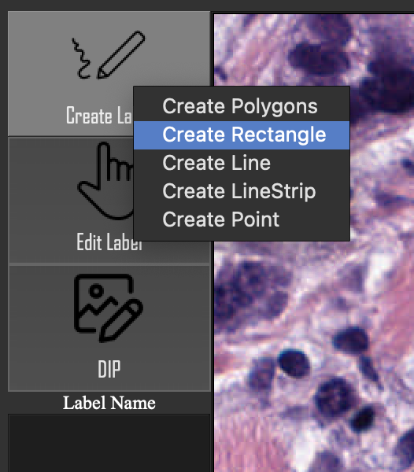
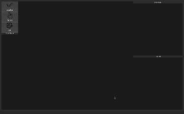
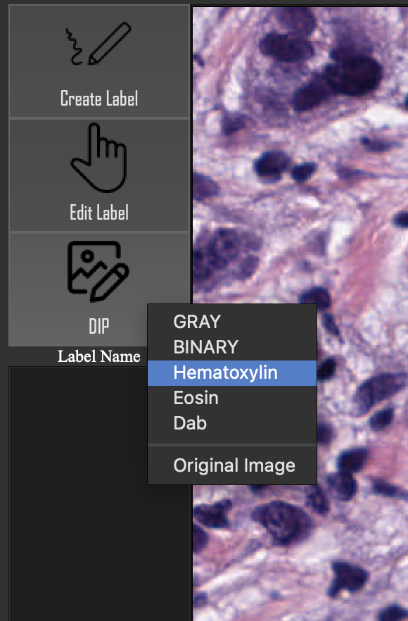
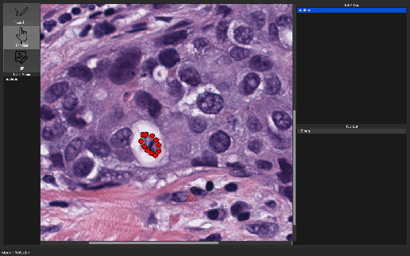

# Biolabel
This tool can process pathology image into specific stain channel and help you label object easily. 
## FileStructure
```
.
├── HE.json
├── HE.png
├── README.md
├── biolabel
│   ├── __main__.py
│   ├── ctrls
│   │   └── controller.py
│   ├── icons
│   │   ├── cancel.png
│   │   ├── edit-image.png
│   │   ├── icon.png
│   │   ├── pen.png
│   │   └── select.png
│   ├── model
│   │   ├── File.py
│   │   ├── FileService.py
│   │   ├── Image.py
│   │   ├── ImageFile.py
│   │   ├── ImageProcessService.py
│   │   ├── Label.py
│   │   ├── LabelFile.py
│   │   ├── LabelList.py
│   │   ├── LabelService.py
│   │   └── Point.py
│   ├── utils
│   │   └── rect.py
│   └── views
│       ├── LabelNameDialog.py
│       ├── Ui_MainWindow.py
│       ├── Ui_label.py
│       └── canvas.py
├── img
│   ├── ChangeColor.gif
│   ├── DeleteCreate.gif
│   ├── Export.gif
│   ├── OpenCreate.gif
│   ├── createLabel.png
│   └── imageProcess.png
├── myExcel.csv
├── requirements.txt
└── test
    ├── __main__.py
    ├── for_FStest.json
    ├── test_file.py
    ├── test_fileService.py
    ├── test_image.py
    ├── test_imageProcessService.py
    ├── test_imagefile.py
    ├── test_label.py
    ├── test_labelService.py
    ├── test_labelfile.py
    ├── test_labellist.py
    └── test_point.py

9 directories, 45 files
```

## Environment
This tool can be executed in Windows and MacOS platform.
We recommend that you install it in Anaconda.
```
conda create --name biolabel python
conda activate biolabel
conda install -c anaconda pyqt
conda install -c conda-forge opencv
pip install -r requirements.txt
```

## Usage
```
python biolabel
```

## Demo
### create labels
In Create Label Mode, you can create some shape of labels by left click for starting and right click for ending.
- Polygons
- Rectangle (bbox)
- Line
- LineStrip
- Point




### digital image process
- RGB2Gray
- RGB2Binary
- turn to Hematoxylin channel
- turn to Eosin channel
- turn to Dab channel



### edit labels
- change color of labels
- change name of labels
- change position of labels
- delete specific label


### save your labels
File -> save or save as..

### Export process image or label
For example, if you want to annotate an image in Hematolyin and export H channel as a PNG file.
```
1. File -> Open
2. DIP -> Hematolyin
3. Create and Edit Labels
4. File -> Save
5. File -> Export Image -> input your filename and format
6. File -> Export Label -> input your filename (.csv)
```


